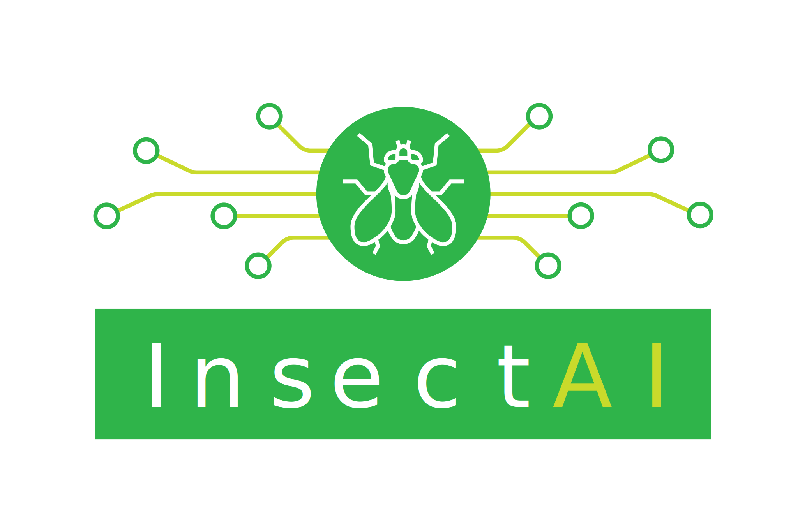
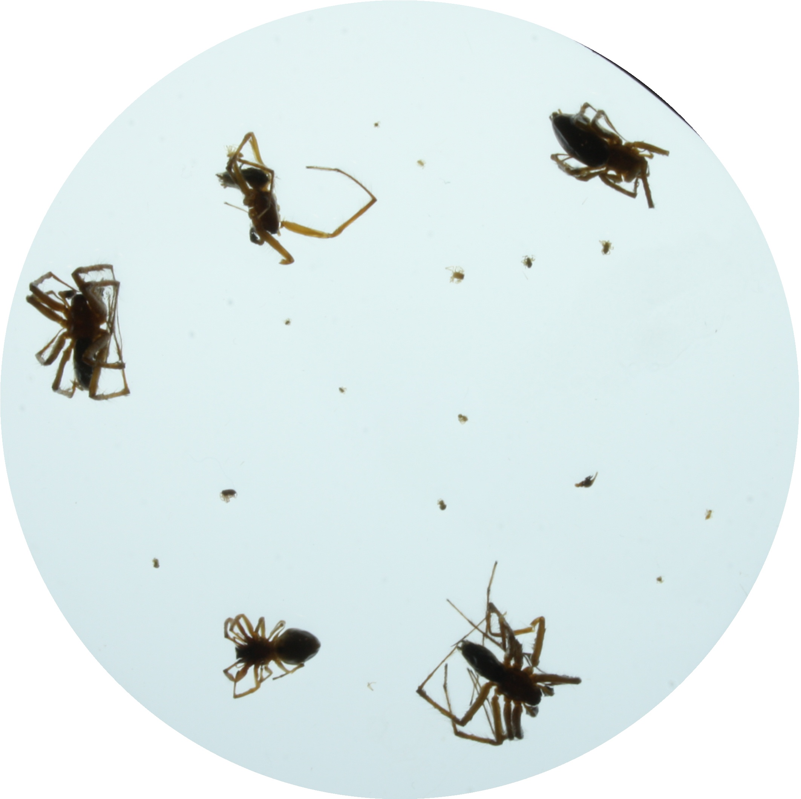
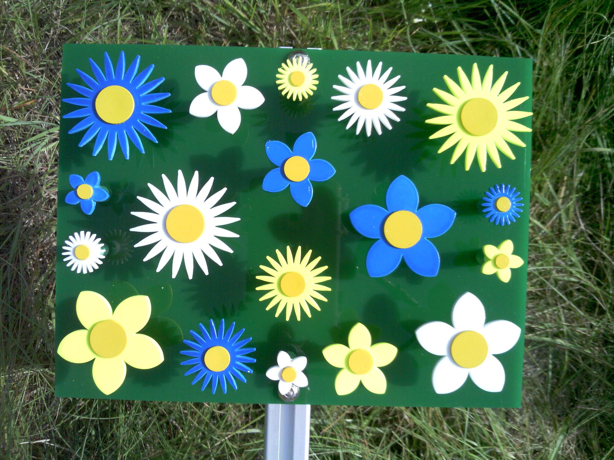

# InsectAI Example Datasets and Standards Development

    
    <!--  
     -->

---

## 📁 Example Dataset Progress
<!-- START: DATASET PROGRESS TABLE -->
<!-- Do NOT manually edit! -->

|  **Dataset**  &emsp;&emsp;&emsp;&emsp;&emsp;&emsp;&emsp;&emsp;&emsp;&emsp;&emsp;&emsp;&emsp;&emsp;&emsp; |  **Status** &emsp;&emsp;&emsp;&emsp;&emsp;&emsp;&emsp;&emsp;&emsp; |  **Example Image** &emsp;&emsp;&emsp;&emsp;&emsp;&emsp;&emsp;&emsp;&emsp;&emsp;&emsp;&emsp;&emsp;&emsp;&emsp;&emsp;&emsp;&emsp;&emsp;&emsp;&emsp;&emsp;&emsp; |
| ---: | :---: | :---: |
| [**amber**](/datasets/amber) | 🔴 Failed (1/5) | _No image tag found_ |
| [**antenna**](/datasets/antenna) | 🟠 Partial (2/5) | _No image tag found_ |
| [**diopsis**](/datasets/diopsis) | 🟠 Partial (2/5) | _No image tag found_ |
| [**flatbug**](/datasets/flatbug) | 🟠 Partial (3/7) |  |
| [**flower_visitors**](/datasets/flower_visitors) | 🔴 Failed (1/5) | _No image tag found_ |
| [**ias**](/datasets/ias) | 🟡 Almost (3/5) |  |
| [**insect-detect**](/datasets/insect-detect) | 🔴 Failed (1/5) | _No image tag found_ |
| [**lepmon**](/datasets/lepmon) | 🟠 Partial (2/5) | _No image tag found_ |
| [**minimon**](/datasets/minimon) | 🟡 Almost (3/5) |  |
| [**plant-pollinator-interactions**](/datasets/plant-pollinator-interactions) | 🔴 Failed (1/5) | _No image tag found_ |
| [**rangex**](/datasets/rangex) | 🟢 Success (5/5) |  |

<!-- Last updated: 2026-04-21 09:38:00 UTC -->
<!-- END: DATASET PROGRESS TABLE -->
---

## 🧪 Contents

- `datasets/` – example datasets
- `resources/` – logos and images for use in readmes, notebooks and presentations
- `templates/` – generic scripts to convert data to Camtrap DP or InsectAI extensions thereof
- `README.md` – this readme!
- `requirements.txt` – Python dependencies for running the conversion scripts
- `*_template.csv` – reference files used to initialize the Camtrap DP CSVs. These contain all necessary headers to ensure the final output meets the data package specifications

---

## 📂 Dataset Organization

The `datasets/` directory is structured to facilitate the conversion from raw data formats to the [Camtrap DP](https://tdwg.github.io/camtrap-dp/) standard.

### 📦 Dataset Subfolders
Each individual dataset is located in a folder named `<DATASET_NAME>` with the following internal structure:

| Component | Description |
| :--- | :--- |
| `media/` | Folder containing all images, potentially organized into subdirectories. |
| `raw-data/` | The original annotations in their source format (JSON, CSV, TXT, etc.). |
| `code/` | Folder containing the conversion scripts (Jupyter, R, etc.) used to convert the dataset in raw format to the Camtrap DP standard. |
| `README.md` | A readme file describing the dataset, its source, and any specific details about the conversion process. |
| `deployments.csv` | **Generated:** Records of camera/sensor deployments. |
| `media.csv` | **Generated:** Metadata for all media files. |
| `observations.csv`| **Generated:** Taxonomic or individual observations. |
| `datapackage.json`| **Generated:** The metadata descriptor for the data package. |

---

## The datathon

The "datathon" is a 2-day workshop where InsectAI members work together to standardize disparate insect “minidatasets”, creating reproducible examples for the wider community. 

Along the way, we reflect on and develop Camtrap DP and InsectAI data standards, produce scripts for data mapping, and journalize the experience of standardizing data and metadata.

We will prove to ourselves (and the world!) that we can store our data in a common format, laying foundations for future collaborations and insect image megadatasets 💾

The living document for the datathon, including the agenda, can be found [here](https://docs.google.com/document/d/1cKWa8PrLWBIouEVd4cDQMRyp790YwyWv_DP1zxm-vxc/edit?usp=drivesdk).

## InsectAI data challenges

The "minidatasets" presented here demonstrate one or more of the common challenges of InsectAI data:

- Detections or classifications from multiple models or multiple annotators for a single image
- Large datasets, of which not all needs to be pushed to e.g. GBIF
- Taxonomic ambiguity and coarse identifications
- Dense time-lapse data with tracks of individuals leaving and re-entering the frame; frequent occlusions
- Datasets that comprise regions of interest or "crops" of original source images
- Variable labelling scope. All pollinators vs. all insects vs. all arthropods?

## Outcomes of the datathon

- Several example standardized datasets to browse and learn from under `datasets/`
- Refined InsectAI/Camtrap DP standards (including github issues to petition the Camtrap DP team), feeding into the InsectAI WG3 report
- A presentation and online materials (especially READMEs under `datasets/<DATASET_NAME>`) to disseminate and demystify working with standards
- Scripts and tools to map data to, and read data from, Camtrap DP/InsectAI (also under `datasets/<DATASET_NAME>`)

## Link to 2025 InsectAI demo of CamtrapDP

[https://github.com/cpadubidri/insectAI-demo.git]

## Link to awesome-insectai

Please consider contributing links to models and other resources for insect detection and classification below:

[https://github.com/InsectAI-COST-Action/awesome-insectai.git]

