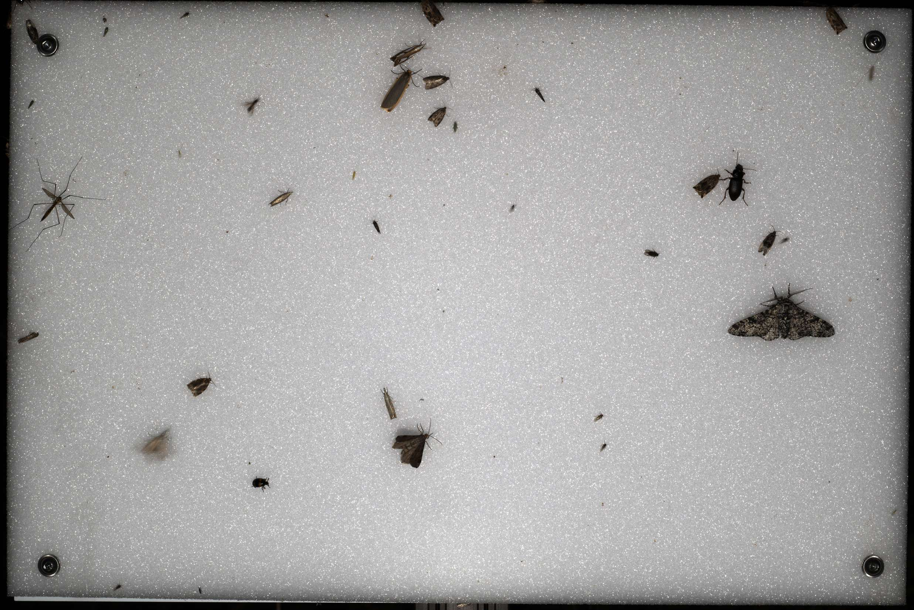

<!-- Image: media/Lepmon#SN010030_TH_J_2025-07-02_T_2330.jpg -->
# Sample dataset fromt the lepmon project

## Media folder contents
The folder `media` contains the raw data as they are uploaded from the camera: one run from one nights moth observation. Here: Juky 2nd 2025 between 9:04 pm till 5:34 am next day.

### Files:
 - *.jpg: raw images from the camera device
 - Lepmon#SN010030_TH_J_2025-07-02_T_2102.csv: metadata about each image, including abiotic sensoric and trechnical measurements
 - Lepmon#SN010030_TH_J_2025-07-02_T_2102.log: lofgile of the run
 - Lepmon#SN010030_TH_J_2025-07-02_T_2102_Kameraeinstellungen: Camera settings

## Data folder contents

Alle files for the different tables in json and csv format:
- meatadata
- deployment
- media
- detections
- model

## Open questions

- Link to bbox url if present missing?
- What about measurement values taken with each image, e.g. temperature, light conditions, etc.? 
- Methods for capturing, processing?
